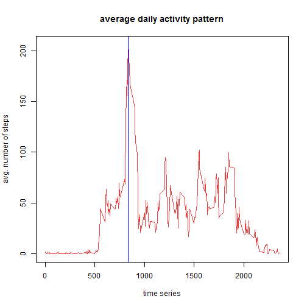
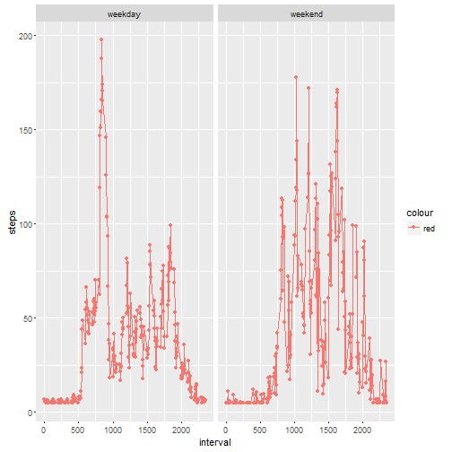

Assignment-1 Report
==============================
<br/>
<div color="red"><h3>Introduction</h3></div>

It is now possible to collect a large amount of data about personal movement using activity monitoring devices such as a Fitbit, Nike Fuelband, or Jawbone Up. These type of devices are part of the "quantified self" movement - a group of enthusiasts who take measurements about themselves regularly to improve their health, to find patterns in their behavior, or because they are tech geeks. But these data remain under-utilized both because the raw data are hard to obtain and there is a lack of statistical methods and software for processing and interpreting the data.

This assignment makes use of data from a personal activity monitoring device. This device collects data at 5 minute intervals through out the day. The data consists of two months of data from an anonymous individual collected during the months of October and November, 2012 and include the number of steps taken in 5 minute intervals each day.

<br/><hr/>

### 1. Obtaining the data  
##### the data here are obtained from this repo at **Github** :  [GitHub repository created for this report][1]
[1]: http://github.com/rdpeng/RepData_PeerAssessment1
<hr/>

### 2. Loading and preprocessing the data

<br/>

#### 1. loading the data:  

```r
setwd("C:/Users/Abdalla _Hn/Downloads/R Assignments/DataScience/Course 5/week 2");
activity<-read.csv("activity.csv");
```

<br/>

####  2. Processing the data:  


```r
## remove the NA values
cleaned_activity<-activity[complete.cases(activity),] ;
```
</br><hr/>
  
### 3.What is the average daily activity pattern?

<br/>

#####here we calculat the total number of steps pere day and show the mean and median for it

```r
library(dplyr);
#########################################################
## here will make a new table that contain
##the total number of step per day in the "date" variable
#########################################################
total_step_perday<-as.data.frame(cleaned_activity %>% group_by(date) %>% summarise_each(funs(sum(.)),steps));

###########################
## making the plot
hist(total_step_perday$steps,breaks = 12,xlab = "total number of steps",main = " total number of steps",col = colors()[34]);

abline(v=mean(total_step_perday$steps),col=colors()[144]);
abline(v = median(total_step_perday$steps),col=colors()[201]);

legend(legend = c("mean","median"), "topright",col=c(colors()[144],colors()[201]),pch="_");
text(x=3000,y=13,"the mean and median\n are the same");
```


<hr/>
### 3.What is the average daily activity pattern?
<br/>


```r
A_grouped_by_interval  <-  cleaned_activity %>% group_by(interval) %>% summarise_each(funs(mean(.)),steps);

plot(A_grouped_by_interval$interval,A_grouped_by_interval$steps,main = "average daily activity pattern",xlab = "time series",ylab ="avg. number of steps",col= colors()[34],type = "l");
abline(v=A_grouped_by_interval$interval[which(A_grouped_by_interval$steps==max(A_grouped_by_interval$steps))],col="blue");
```




<ul><li><h5>from the previose plot we find that the 5-minute interval whitch contains the maximum number of steps is:<h4> 835</h4> </h5></li></ul>
<br/><br/>
</hr>

### 4.Imputing missing values:
<br/>
<ul><li><h4>firstly we will calculate the total number of missing values in the dataset:</h4></li></ul>


```r
total_num_of_NA <- sum(!complete.cases(activity));
```

<h5>   so the total number of rows that contains NA value is 2304</h5>
<br/>


<ul><li><h4>secondly we will fill in the missing value with the mean of its variable <h5>(calculated with out the NAs)</h5>:</h4></li></ul>


```r
mean_of_steps_perday<-as.data.frame( cleaned_activity %>% group_by(date) %>% summarise_each(funs(mean(.)),steps));
        
mean_of_steps<-mean(cleaned_activity$steps);
## here is the new data set with the  the missing data filled in:
filled_activity<-activity;       
filled_activity[is.na(match(activity$date,mean_of_steps_perday$date)),1]<-mean_of_steps;
```
</br>
<ul><li><h4>finally: will make a histogram of the total number of steps taken each day </h4></li></ul>

```r
total_step_perday<-as.data.frame(filled_activity%>% group_by(date) %>% summarise_each(funs(sum(.)),steps));


hist(total_step_perday$steps,breaks = 12,xlab = "total number of steps",main = " total number of steps",col = colors()[30]);

abline(v=mean(total_step_perday$steps),col=colors()[144]);
abline(v = median(total_step_perday$steps),col=colors()[201]);

legend(legend = c("mean","median"), "topright",col=c(colors()[144],colors()[201]),pch="_");
text(x=3000,y=13,"the mean and median\n are the same");
```


```r
mean<-mean(mean(total_step_perday$steps));
median<-median(total_step_perday$steps);
```

<h4> as we see that the mean num of steps is:1.0766189 &times; 10<sup>4</sup> and the median is: 1.0766189 &times; 10<sup>4</sup> </h4>
</br>
<hr/>
### 5.Are there differences in activity patterns between weekdays and weekends?
</br>
<ul><li><h4>first we will make new variable called weekday to store the weekday of the obsevation :</ul></li></h4>


```r
library(ggplot2);
##creat new variable called weekday
g<-weekdays(as.POSIXct(filled_activity$date))=="Sunday";

filled_activity$weekday<-"weekday";
filled_activity[g,"weekday"]<-"weekend";

##grouping the variable by week day
A_grouped_by_intervalWeekday  <-  filled_activity %>% group_by(interval,weekday) %>% summarise_each(funs(mean(.)),steps);
weekdayGroupe<-subset(A_grouped_by_intervalWeekday,weekday=="weekday");
weekendGroupe<-subset(A_grouped_by_intervalWeekday,weekday=="weekend");

##ploting the avreged steps
qplot(interval,steps,facets =.~weekday ,data = as.data.frame(A_grouped_by_intervalWeekday),color="red")+geom_line();
```




